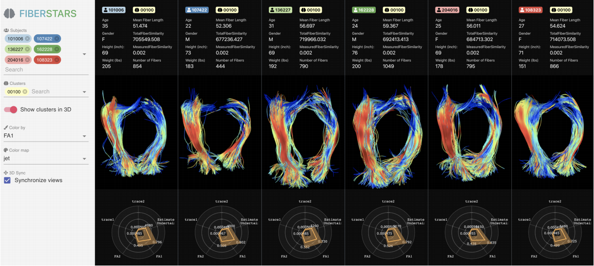

# A template for project reports at BrainHack School

Team contributors: the Brainhack School team, Ziad Guenoun, and anyone who wants to contribute !

## Summary 

For this project, I will be learning how to use new brain imaging tools for group analyses. I will focus on fiber visualisations and predictions based on functional connectivity.

## Project definition 

I will divide my project into 2 objectives :
 1- Learn how to train a machine learning model to predict certain features based on functional connectomes (genetic status could be a great start !)
 2- (for fun) Familiarise myself with group analyses on diffusion data

### Background

I have a background in fundamental cognitive neuroscience and have previously worked on projects in imaging genetics.

### Tools 

The fibers project will rely on the following technologies: 

- Fiberstars
https://arxiv.org/pdf/2005.08090.pdf
This software allows for group analyses on diffusion data as well as fiber visualisations.

- NiLearn
https://nilearn.github.io/

### Data 

I found this great dataset for working with genetic data and functional connectivity :
http://preprocessed-connectomes-project.org/abide/
(thanks Mikkel Schöttner and Andréanne Proulx !)

I also plan on exploring some diffusion data, I found a dataset of the structural brain networks of gifted children but I think I'll need some other dataset
( https://openneuro.org/datasets/ds002726/versions/1.0.1 )

### Deliverables

At the end of this project, we will have:
 - The current markdown document, completed and revised.
 - A gallery of the student projects at Brainhack 2020.
 - A progress report (maybe interactive ? using jupyter notebook)

## Results 

### Progress overview

### Tools I learned during this project

 * **Github workflow-** The successful use of this template approach will demonstrate that it is possible to incorporate dozens of students presentation on a website collaboratively over a few weeks. 
 * **Project content** Through the project reports generated using the template, it is possible to learn about what exactly the brainhack school students are working on. 
 
### Results 

#### Deliverable 1: report template

#### Deliverable 2: project gallery
 
 
 
## Conclusion and acknowledgement

# fibers-fMRI-BHS2020
